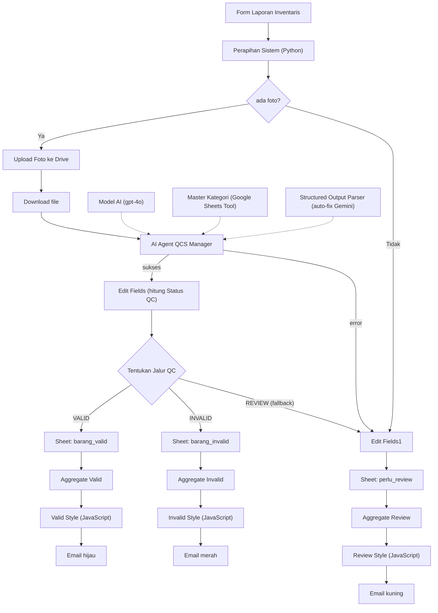

# Automated QC & Inventory Reporting System (n8n)

Workflow n8n yang mengubah laporan inventaris gudang yang diketik manual menjadi data terstruktur yang **diverifikasi AI berdasarkan foto bukti**, dikategorikan otomatis, dicatat ke Google Sheets, dan dirangkum lewat email berwarna sesuai tingkat risiko.

Petugas hanya mengisi **nama barang dan jumlah** serta mengunggah foto. Kategori barang, penilaian kondisi fisik, dan keputusan lolos atau tidaknya ditentukan oleh AI Agent. Supervisor hanya perlu menangani pengecualian.

> Final Project (Capstone) kelas **AI Automation Engineer, PPKD JB**.

---

## Daftar Isi

1. [Masalah yang Diselesaikan](#masalah-yang-diselesaikan)
2. [Fitur Utama](#fitur-utama)
3. [Arsitektur Workflow](#arsitektur-workflow)
4. [Komponen Workflow](#komponen-workflow)
5. [Input Form](#input-form)
6. [Logika Keputusan (Business Logic)](#logika-keputusan-business-logic)
7. [Peran AI di Dalam Workflow](#peran-ai-di-dalam-workflow)
8. [Struktur Google Sheets](#struktur-google-sheets)
9. [Penjelasan Node Code](#penjelasan-node-code)
10. [Pemetaan Syarat dan Rubrik](#pemetaan-syarat-dan-rubrik)
11. [Panduan Instalasi](#panduan-instalasi)
12. [Skenario Pengujian](#skenario-pengujian)
13. [Keterbatasan](#keterbatasan)
14. [Rencana Pengembangan](#rencana-pengembangan)
15. [Keamanan dan Privasi](#keamanan-dan-privasi)
16. [Penulis](#penulis)

---

## Masalah yang Diselesaikan

Pelaporan barang di gudang atau kantor umumnya dilakukan dengan mengetik daftar bebas. Dari pola kerja seperti ini muncul empat masalah yang berulang:

| Masalah | Dampak |
|---|---|
| Kategori ditulis bebas ("Laptop", "laptop", "Perangkat Elektronik") | Data kotor, sulit direkap |
| Kondisi barang tidak terbukti | Barang rusak baru diketahui belakangan |
| Tidak ada bukti visual yang tertaut ke data | Sulit diaudit |
| Supervisor memeriksa semua laporan satu per satu | Waktu terbuang untuk laporan yang sebenarnya sudah benar |

**Mengapa perlu otomasi dan AI:** aturan pengecekan sederhana tidak bisa menilai isi sebuah foto. Model AI dengan kemampuan melihat gambar dapat mencocokkan nama barang dengan foto, memilih kategori resmi, dan menilai kondisi fisik, sehingga manusia hanya turun tangan ketika AI ragu atau menemukan masalah.

## Fitur Utama

- **Input minimal.** Petugas cukup menulis `Nama Barang : Jumlah` per baris dan melampirkan foto.
- **AI memutuskan kategori dan kondisi.** Kategori dibatasi pada daftar resmi di Google Sheets (`master_kategori`), kondisi dinilai dari foto (Sangat Baik, Baik, Rusak).
- **Verifikasi foto terhadap nama barang.** AI memeriksa apakah barang di foto sesuai dengan yang dilaporkan.
- **Routing tiga jalur:** VALID, INVALID, dan PERLU REVIEW berdasarkan hasil AI dan tingkat keyakinannya.
- **Jejak audit.** Setiap baris menyimpan foto bukti (tertaut ke Google Drive), tingkat keyakinan AI, dan alasan AI.
- **Email rekap berwarna per status** (hijau, merah, kuning) yang dikirim ke email petugas, lengkap dengan saran tindak lanjut.
- **Tahan gagal.** Percobaan ulang otomatis, perbaikan format output AI otomatis, dan jalur khusus bila agent gagal.

## Arsitektur Workflow



## Komponen Workflow

| Node | Tipe | Fungsi |
|---|---|---|
| Form Laporan Inventaris | Form Trigger | Titik masuk. Menerima data petugas, daftar barang, dan foto |
| Perapihan Sistem | Code (Python) | Memecah satu submit menjadi satu item per barang, mencocokkan foto, memberi nama file standar |
| ada foto? | If | Memisahkan barang yang punya foto dari yang tidak |
| Upload Foto ke Drive | Google Drive | Menyimpan foto bukti ke folder `bukti_foto_barang` |
| Download file | Google Drive | Mengambil file agar dapat dibaca AI sebagai gambar |
| AI Agent QCS Manager | AI Agent | Menilai satu barang: kesesuaian foto, kategori, kondisi, keyakinan, alasan |
| Model AI | OpenAI Chat Model (gpt-4o) | Model bahasa dan vision untuk agent |
| Master Kategori | Google Sheets Tool | Tool agent untuk membaca daftar kategori resmi |
| SOP | Structured Output Parser | Memaksa output AI menjadi JSON dengan skema tetap, dengan auto-fix memakai Google Gemini |
| Edit Fields | Set | Menyusun data akhir dan menghitung field `Status QC` |
| Tentukan Jalur QC | Switch | Mengarahkan item ke jalur VALID, INVALID, atau REVIEW (fallback) |
| Edit Fields1 | Set | Menyeragamkan data untuk jalur review (tanpa foto, error agent, atau keyakinan rendah) |
| barang valid, barang invalid, barang perlu di review | Google Sheets (Append) | Mencatat setiap item ke tab yang sesuai |
| Aggregate Valid / Invalid / Review | Aggregate | Menggabungkan semua item satu jalur menjadi satu |
| Valid Style, Invalid Style, Review Style | Code (JavaScript) | Menyusun email HTML berwarna beserta tabel rekap |
| Kirim Email Rekap Petugas (3 node) | Gmail | Mengirim email rekap ke alamat email petugas yang mengisi form |

## Input Form

| Field | Tipe | Wajib | Keterangan |
|---|---|---|---|
| Nama Petugas | Teks | Ya | Identitas pelapor dan bagian dari nama file foto |
| Email Petugas | Teks | Ya | Tujuan email rekap |
| Jabatan | Dropdown | Ya | 10 pilihan jabatan gudang (admin gudang, kepala gudang, petugas K3, dan lainnya) |
| Daftar Barang | Textarea | Ya | Satu barang per baris, format `Nama Barang : Jumlah` |
| Lokasi Barang | Dropdown | Ya | Gudang Pusat, Barat, Timur, Selatan, atau Utara |
| Tanggal Laporan | Tanggal | Ya | Tanggal pengecekan |
| Bukti Foto | File (banyak) | Disarankan | Hanya `.jpg`, `.jpeg`, `.png`. Satu foto per barang, atau satu foto kolektif yang jelas |
| Catatan fisik/tambahan jika ada | Textarea | Tidak | Detail kondisi dari petugas |

Contoh isi **Daftar Barang**:

```
Laptop ThinkPad T14 : 2
HP Xiaomi Redmi : 1
Baju Tidur XXL : 5
```

**Aturan pencocokan foto:** foto dicocokkan ke barang berdasarkan urutan baris (foto pertama untuk baris pertama, dan seterusnya). Jika hanya ada satu foto untuk banyak barang, foto itu dipakai sebagai foto kolektif untuk semua baris. Barang tanpa foto otomatis masuk jalur REVIEW.

## Logika Keputusan (Business Logic)

AI menangani kasus yang jelas, manusia menangani pengecualian.

| Status | Syarat | Tindakan yang disarankan |
|---|---|---|
| **VALID** | Foto sesuai nama barang, keyakinan AI minimal 0,7, kondisi bukan Rusak, kategori ada di master | Tidak perlu tindakan. Data tercatat otomatis |
| **INVALID** | Foto tidak sesuai nama barang, atau kondisi Rusak (dengan keyakinan minimal 0,7) | Karantina barang, retur ke vendor, atau koreksi input |
| **REVIEW** | Tanpa foto, keyakinan di bawah 0,7, output AI tidak lengkap, kategori di luar master, atau agent gagal | Inspeksi manual dalam 1x24 jam |

Rumus penentu status (field `Status QC` pada node Edit Fields):

```javascript
{{ (() => {
  const o = $json.output;
  if (!o || o.sesuai_foto === undefined || Number(o.confidence) < 0.7 || o.kategori === 'TIDAK_ADA') return 'REVIEW';
  return (o.sesuai_foto === true && o.kondisi_fisik !== 'Rusak') ? 'VALID' : 'INVALID';
})() }}
```

Ambang keyakinan 0,7 bersifat konservatif: lebih baik mengirim barang ke review manusia daripada mencatat data yang diragukan sebagai valid. Nilai ini perlu dikalibrasi ulang dengan data uji nyata (lihat [Skenario Pengujian](#skenario-pengujian)).

## Peran AI di Dalam Workflow

### Model dan tool
- **Model utama:** OpenAI `gpt-4o` (mendukung masukan gambar). Dipilih karena kemampuan membaca gambar yang baik dan kepatuhan terhadap format output terstruktur.
- **Tool agent:** `Master Kategori` (Google Sheets Tool). Agent wajib memilih kategori hanya dari daftar resmi, sehingga kategori konsisten dan dapat diubah admin tanpa menyentuh prompt.
- **Output Parser:** Structured Output Parser dengan skema tetap. Jika format output meleset, fitur auto-fix memanggil Google Gemini untuk memperbaikinya, sehingga workflow memiliki lapisan pengaman berbasis model kedua.

### Desain prompt
Prompt disusun dengan struktur berikut:

| Bagian | Isi | Alasan |
|---|---|---|
| Peran | AI Quality Control gudang yang menilai satu barang per panggilan | Membatasi cakupan tugas |
| Konteks | Nama barang, jumlah, dan keterangan petugas dari data form | Memberi pembanding untuk foto |
| Langkah | Deteksi objek, bandingkan dengan nama, pilih kategori dari master, nilai kondisi, isi keyakinan | Alur berpikir berurutan mengurangi kesalahan |
| Kriteria kondisi | Sangat Baik (utuh, bersih), Baik (pemakaian ringan), Rusak (retak, penyok, sobek, atau noda berat) | Kriteria objektif mengurangi subjektivitas |
| Aturan | Dilarang mengarang detail yang tidak terlihat, keyakinan wajib di bawah 0,7 bila foto buram atau ragu, alasan maksimal dua kalimat | Mencegah halusinasi dan memicu jalur review |

### Skema output

```json
{
  "item_terdeteksi": "Nama barang hasil pengamatan foto",
  "sesuai_foto": true,
  "kategori": "Kategori resmi dari master atau TIDAK_ADA",
  "kondisi_fisik": "Sangat Baik",
  "confidence": 0.95,
  "alasan": "Penjelasan singkat berbasis bukti visual"
}
```

### Ketahanan (reliability)
- AI Agent dan node Download file memakai percobaan ulang otomatis (maksimal 5 kali, jeda 5 detik).
- Output error agent diarahkan ke jalur review, bukan menghentikan workflow.
- Parser memiliki auto-fix dan jalur error sendiri.

## Struktur Google Sheets

Spreadsheet `data_inventaris` memiliki empat tab:

| Tab | Isi |
|---|---|
| `barang_valid` | Barang yang lolos verifikasi |
| `barang_invalid` | Barang yang tidak sesuai foto atau rusak |
| `perlu_review` | Barang yang butuh pemeriksaan manusia |
| `master_kategori` | Daftar kategori resmi (dibaca AI Agent). Disarankan menyertakan kolom contoh barang agar klasifikasi lebih akurat |

Kolom pada tab pencatatan (judul laporan di baris 2, header di **baris 5**):

| Kolom | Isi |
|---|---|
| Nama Petugas, Jabatan | Identitas pelapor |
| Nama Barang, Kuantitas Barang, Lokasi Barang | Data barang dari form |
| Kategori Barang | Hasil klasifikasi AI dari master kategori |
| Quality Barang | Kondisi fisik hasil penilaian AI |
| Bukti Foto | Foto bukti yang tertaut ke Google Drive |
| Keterangan Submit | Waktu pengiriman form |
| Confidence AI, Alasan AI | Jejak audit penalaran AI |

## Penjelasan Node Code

Dua jenis node Code digunakan karena node bawaan n8n tidak dapat melakukan transformasi yang dibutuhkan.

### Perapihan Sistem (Python)
**Tujuan:** mengubah satu submit form menjadi satu item per barang, lengkap dengan foto.

1. Membaca data form dan file dari item masuk.
2. Merapikan identitas petugas dan memformat waktu submit.
3. Menyaring file hanya bertipe gambar dan mengurutkannya berdasarkan angka di akhir nama (agar `_10` tidak mendahului `_2`).
4. Memecah textarea menjadi baris. Setiap baris dipisah di titik dua **terakhir** (`rsplit`) supaya nama yang mengandung titik dua tetap aman.
5. Mengambil angka jumlah. Jika tidak valid, diisi 1 dan masalahnya dicatat di `Catatan Parsing`.
6. Mencocokkan foto berdasarkan urutan, dengan aturan foto kolektif untuk satu foto banyak barang.
7. Membuat nama file standar `Bukti_[Barang]_[Petugas]_[Tanggal].[ekstensi]`.
8. Menghasilkan `Kunci Stok`, `Status Foto`, dan `Catatan Parsing` untuk langkah berikutnya.

Kode ditulis tanpa `import` agar kompatibel dengan lingkungan Python native n8n.

### Valid Style, Invalid Style, Review Style (JavaScript)
**Tujuan:** menyusun email HTML dari kumpulan barang pada satu jalur.

1. **Ekstraksi:** membaca array `data` hasil node Aggregate (dengan cadangan jika bentuk input berbeda).
2. **Tabel:** `forEach` membuat satu baris HTML per barang (nomor, petugas, barang, jumlah, kategori, kualitas, alasan) dengan nilai cadangan bila kosong.
3. **Template:** menyusun subjek dan badan email berwarna sesuai risiko (hijau rendah, kuning sedang, merah tinggi), kotak saran tindak lanjut, dan tombol ke Google Sheets.
4. **Return:** mengembalikan satu item berisi `email_subject` dan `email_body` yang dibaca node Gmail.

Ketiganya memiliki struktur sama dan berbeda pada warna serta teks tindak lanjut karena tiap status memerlukan tindakan yang berbeda.

## Pemetaan Syarat dan Rubrik

| Syarat Final Project | Pemenuhan |
|---|---|
| Menggunakan model AI | OpenAI gpt-4o sebagai model agent dan Google Gemini sebagai model auto-fix parser |
| Minimal 2 tools eksternal | Google Drive, Google Sheets, Gmail (selain model AI) |
| Minimal 1 conditional logic | Node If (ada foto) dan Switch (tiga jalur QC) |
| Berjalan tanpa error saat demo | Retry, error output, dan auto-fix pada parser |

| Aspek Rubrik | Bobot | Bukti di Workflow |
|---|---|---|
| Problem and Reasoning | 20% | Masalah pelaporan manual dan alasan perlu AI vision (bagian Masalah yang Diselesaikan) |
| Workflow | 35% | Alur berurutan dengan tiga jalur, penanganan error, penamaan node yang jelas |
| Integrasi Tools | 25% | Drive untuk bukti, Sheets sebagai data dan tool agent, Gmail untuk notifikasi |
| Prompting | 20% | Prompt berstruktur peran, konteks, langkah, kriteria, aturan, dan output terstruktur |

## Panduan Instalasi

### Prasyarat
- Instance n8n (cloud atau self-hosted) yang mendukung AI Agent dan Form Trigger.
- Akun Google (Drive, Sheets, Gmail) dengan OAuth2 di n8n.
- API key OpenAI dan API key Google Gemini.

### Langkah
1. **Impor workflow.** Di n8n: Workflows, Import from File, pilih `Laporan_Invetaris_Instant.json`.
2. **Siapkan spreadsheet.** Buat Google Sheets dengan tab `barang_valid`, `barang_invalid`, `perlu_review`, dan `master_kategori`. Isi header sesuai bagian [Struktur Google Sheets](#struktur-google-sheets) (header tab pencatatan di baris 5).
3. **Isi `master_kategori`** dengan kategori resmi gudang beserta contoh barangnya.
4. **Buat folder Drive** bernama `bukti_foto_barang` untuk menyimpan foto.
5. **Hubungkan kredensial** pada node: Google Drive, Google Sheets (termasuk tool Master Kategori), Gmail, OpenAI, dan Google Gemini.
6. **Arahkan node ke milik Anda.** Pilih ulang dokumen spreadsheet pada semua node Sheets dan folder tujuan pada node upload Drive.
7. **Aktifkan workflow** dan buka URL form dari node Form Laporan Inventaris.

## Skenario Pengujian

| # | Skenario | Hasil yang diharapkan |
|---|---|---|
| 1 | Foto laptop jelas, nama barang "Laptop" | VALID |
| 2 | Foto sepatu, nama barang "Laptop" | INVALID |
| 3 | Foto laptop buram atau gelap | REVIEW |
| 4 | Barang tanpa foto | REVIEW |
| 5 | Foto barang yang jelas rusak (retak atau penyok) | INVALID |
| 6 | Satu submit berisi banyak barang dengan satu foto kolektif | Foto dipakai untuk semua baris |
| 7 | Baris dengan jumlah tidak valid (misal `Kursi : abc`) | Jumlah diisi 1 dan tercatat di Catatan Parsing |

**Metode evaluasi akurasi:** siapkan sekitar 15 barang dengan label benar yang dibuat secara manual (kategori, kondisi, dan jalur yang seharusnya), jalankan seluruhnya melalui workflow, lalu hitung persentase kecocokan kategori, kondisi, dan jalur. Hasil ini digunakan untuk mengkalibrasi ambang keyakinan 0,7.

## Keterbatasan

| Keterbatasan | Penjelasan |
|---|---|
| Jumlah barang tidak diverifikasi | AI tidak dapat menghitung kuantitas secara andal dari foto. Jumlah dipercaya dari input petugas. Sistem ini adalah **verifikasi identitas dan kondisi barang**, bukan penghitung stok |
| Foto dapat dimanipulasi | Foto dari internet dapat menipu verifikasi. Belum ada validasi lokasi, waktu, atau nomor seri |
| Keyakinan AI tidak terkalibrasi | Nilai confidence berasal dari model dan perlu diuji terhadap data nyata |
| Penilaian kondisi bersifat visual | Kerusakan halus atau internal tidak terdeteksi dari foto |
| Google Sheets sebagai penyimpanan | Cukup untuk skala kecil sampai menengah, bukan untuk ribuan SKU dengan transaksi bersamaan |
| Belum mencatat mutasi stok | Belum ada alur barang keluar dan stok berjalan |

## Rencana Pengembangan

1. **Tab stok otomatis** (rumus `QUERY` dari `barang_valid`) dengan **peringatan stok minimum** melalui workflow terjadwal.
2. **Persetujuan review** melalui email dengan tombol Setujui atau Tolak, lalu data otomatis dipindahkan ke `barang_valid`.
3. **Ringkasan mingguan oleh AI** berisi insight (barang yang sering rusak, lokasi dengan review terbanyak).
4. **Dashboard Looker Studio** di atas Google Sheets.
5. **Deteksi laporan ganda** (barang, lokasi, dan tanggal yang sama).
6. **Satu email rekap gabungan** menggantikan tiga email terpisah.
7. Migrasi penyimpanan ke database atau integrasi ERP untuk skala besar.

## Keamanan dan Privasi

- Jangan membagikan kredensial atau API key. Kredensial tersimpan di n8n dan tidak ikut dalam berkas ekspor.
- Berkas ekspor workflow dapat memuat ID spreadsheet, nama dokumen, dan alamat email. **Periksa dan bersihkan sebelum mengunggah ke repositori publik.**
- Foto bukti dikirim ke penyedia model AI untuk dianalisis. Pastikan foto tidak memuat data pribadi atau rahasia perusahaan.
- Atur izin folder Google Drive agar hanya dapat diakses pihak yang berwenang.

## Penulis

**Farel Maulana Yusuf**
Final Project kelas AI Automation Engineer, PPKD JB.
