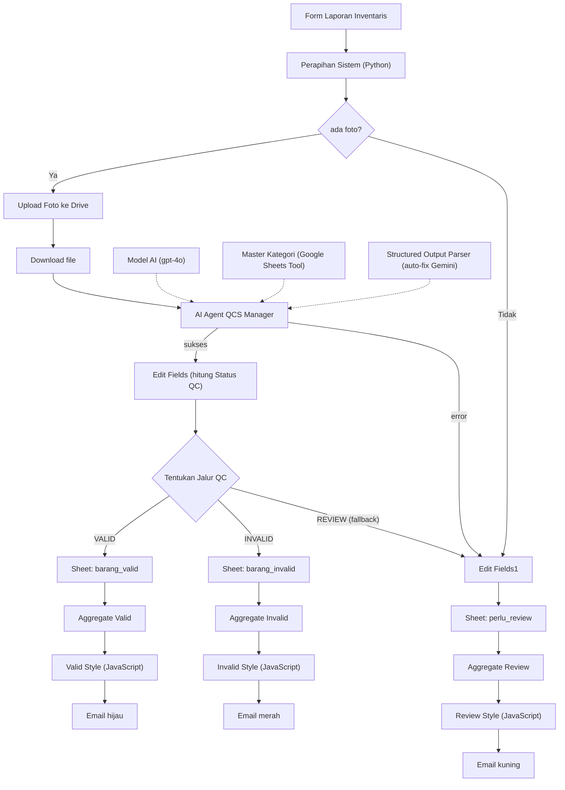

# Automated QC & Inventory Reporting System (n8n)

*Final Project - PPKD Jakarta Barat AI Bootcamp (PPKD AIAE x Hacktiv8)*  
*Author:* Farel Maulana Yusuf

---

## Deskripsi Proyek

Proyek ini adalah sebuah sistem otomatisasi alur kerja (*workflow*) berbasis AI yang dibangun menggunakan **n8n**. Sistem ini dirancang untuk mengubah laporan inventaris gudang yang diketik manual menjadi data terstruktur yang **diverifikasi AI berdasarkan foto bukti**, dikategorikan secara otomatis, dicatat ke Google Sheets, dan dirangkum lewat email berwarna sesuai dengan tingkat risiko.

Petugas hanya perlu mengisi **nama barang dan jumlah** serta mengunggah foto bukti. Kategori barang, penilaian kondisi fisik, dan keputusan lolos/tidaknya laporan ditentukan oleh **AI Agent**. Supervisor hanya perlu mengecek dan menangani kasus pengecualian (*exceptions*).

---

## Latar Belakang Masalah

Pelaporan barang di gudang atau kantor umumnya dilakukan dengan mengetik daftar bebas secara manual. Dari pola kerja ini, muncul empat masalah utama:

- **Data Kotor & Tidak Konsisten:** Kategori ditulis bebas (contoh: *"Laptop"*, *"laptop"*, *"Perangkat Elektronik"*), membuat rekapitulasi data sulit dilakukan.
- **Kondisi Fisik Tanpa Bukti:** Barang rusak baru diketahui belakangan karena tidak ada verifikasi awal.
- **Sulit Diaudit:** Tidak ada bukti visual yang terhubung langsung ke baris pencatatan data.
- **Tidak Efisien:** Supervisor harus memeriksa semua laporan satu per satu, menyita waktu untuk laporan yang sebenarnya sudah valid.

*Mengapa perlu otomasi dan AI:* Aturan logika sederhana tidak bisa menilai isi sebuah foto. Model AI dengan kemampuan penglihatan (*vision*) dapat mencocokkan nama barang dengan foto, memilih kategori resmi, dan menilai kondisi fisik secara otomatis.

---

## ✨ Fitur Utama

1. 📝 **Input Minimal:** Petugas cukup menulis `Nama Barang : Jumlah` per baris dan melampirkan foto pada form.
2. 🏷️ **Smart Categorization & Condition Assessment:** AI menentukan kategori barang berdasarkan daftar resmi (`master_kategori`) dan menilai kondisi fisik (Sangat Baik, Baik, Rusak).
3. 👁️ **Visual Verification:** AI memverifikasi apakah foto yang diunggah sesuai dengan nama barang yang dilaporkan.
4. 🔀 **Routing Tiga Jalur (QC Logic):** Mengarahkan data ke jalur `VALID`, `INVALID`, atau `PERLU REVIEW` berdasarkan hasil AI dan tingkat keyakinannya (*confidence score*).
5. 📊 **Jejak Audit Terstruktur:** Setiap baris pencatatan menyimpan URL foto bukti di Google Drive, tingkat keyakinan AI, serta alasan penalaran AI.
6. 📧 **Automated Color-Coded Email Reporting:** Mengirimkan rekapitulasi laporan berwarna (hijau untuk Valid, merah untuk Invalid, kuning untuk Review) beserta rekomendasi tindak lanjut ke email petugas.
7. 🛡️ **Sistem Tahan Gagal (Fault-Tolerant):** Dilengkapi percobaan ulang otomatis (*retry logic*), perbaikan format output AI otomatis (*auto-fix parser*), dan jalur khusus (*fallback*) jika agent gagal.

---

## 🛠️ Arsitektur & Teknologi (Tools)

- **Platform Automation:** [n8n](https://n8n.io)
- **AI Model:** OpenAI `gpt-4o` (Vision/Agent) & Google Gemini API (Structured Output Auto-Fix)
- **User Interface:** n8n Form Trigger
- **Penyimpanan Data:** Google Sheets & Google Drive
- **Distribusi Laporan:** Gmail

---

## ⚙️ Alur Kerja (Workflow)



1. **Trigger & Pre-processing:** Data dikirim melalui n8n Form. Node Python memecah textarea menjadi per barang, merapikan identitas, dan mencocokkan foto bukti.
2. **Media Handling:** Foto disimpan ke Google Drive dan diunduh kembali agar dapat dibaca oleh AI Vision.
3. **AI Evaluation:** AI Agent (`gpt-4o`) memeriksa barang, mencocokkan dengan daftar `master_kategori` via Google Sheets Tool, dan mengekstrak JSON terstruktur.
4. **Logic & Routing:** Sistem menghitung `Status QC` dan mendistribusikan data ke tab Google Sheets yang sesuai (`barang_valid`, `barang_invalid`, atau `perlu_review`).
5. **Notification:** Node Aggregate menggabungkan data, menyusun template HTML berwarna via JavaScript, dan mengirimkan rekapitulasi via Gmail.

---

## 🧠 Logika Keputusan & Peran AI

### Rumus Penentu Status QC

```javascript
{{ (() => {
  const o = $json.output;
  if (!o || o.sesuai_foto === undefined || Number(o.confidence) < 0.7 || o.kategori === 'TIDAK_ADA') return 'REVIEW';
  return (o.sesuai_foto === true && o.kondisi_fisik !== 'Rusak') ? 'VALID' : 'INVALID';
})() }}

```

| Status | Syarat Utama | Tindakan Sistem |
| --- | --- | --- |
| **VALID** | Foto sesuai, confidence $\ge 0.7$, kondisi bukan Rusak, kategori terdaftar | Dicatat otomatis ke `barang_valid`, kirim email hijau. |
| **INVALID** | Foto tidak sesuai ATAU kondisi Rusak (confidence $\ge 0.7$) | Dicatat ke `barang_invalid`, kirim email merah untuk tindakan retur/karantina. |
| **REVIEW** | Tanpa foto, confidence $< 0.7$, output tidak lengkap, atau agent error | Dicatat ke `perlu_review`, kirim email kuning untuk inspeksi manual. |

---

## 🚀 Cara Menjalankan (Prasyarat)

Untuk mengimpor dan menjalankan *workflow* ini di *instance* n8n kamu sendiri, kamu memerlukan kredensial berikut:

1. **OpenAI API Key** (akses ke model `gpt-4o`).
2. **Google Gemini API Key** (dari Google AI Studio untuk *auto-fix parser*).
3. **Google OAuth2 Credentials** (untuk akses Google Drive, Google Sheets, dan Gmail).
4. **Spreadsheet Google Sheets** (`data_inventaris`) dengan 4 tab:
* `barang_valid`
* `barang_invalid`
* `perlu_review`
* `master_kategori` (berisi daftar kategori resmi gudang)


5. **Folder Google Drive** bernama `bukti_foto_barang` untuk menyimpan berkas foto.

### Langkah Import:

1. Unduh berkas `Laporan_Invetaris_Instant.json`.
2. Masuk ke n8n $\rightarrow$ **Workflows** $\rightarrow$ **Import from File**.
3. Hubungkan masing-masing kredensial pada node Drive, Sheets, Gmail, OpenAI, dan Gemini.
4. Pilih dokumen spreadsheet dan folder Drive target pada konfigurasi node.
5. Aktifkan *workflow* dan jalankan via **Form Trigger URL**.

---

## 🧪 Skenario Pengujian

| # | Skenario | Expected Output |
| --- | --- | --- |
| 1 | Foto laptop jelas, nama barang "Laptop" | **VALID** |
| 2 | Foto sepatu, nama barang "Laptop" | **INVALID** |
| 3 | Foto laptop buram / gelap | **REVIEW** |
| 4 | Laporan dikirim tanpa foto | **REVIEW** |
| 5 | Foto barang yang jelas terlihat rusak (penyok/retak) | **INVALID** |

---

## ⚠️ Keterbatasan & Rencana Pengembangan

### Keterbatasan

* **Kuantitas Barang:** AI berfokus pada verifikasi identitas dan kondisi visual, bukan menghitung jumlah fisik barang secara presisi dari foto.
* **Sifat Penilaian:** Penilaian kondisi fisik bersifat visual; kerusakan internal/mesin tidak dapat terdeteksi.

### Rencana Pengembangan

* 📊 Integrasi Dashboard **Looker Studio** di atas Google Sheets.
* 🔔 Sistem Peringatan Stok Minimum (*Low Stock Alerts*) otomatis.
* ✉️ Fitur *Interactive Email Approval* (Setujui/Tolak langsung dari email).

---

## 👨‍💻 Penulis

**Farel Maulana Yusuf**

*AI Automation Engineer Student - PPKD Jakarta Barat x Hacktiv8*

```

```
